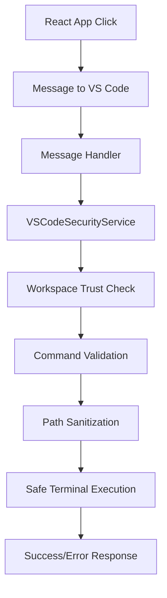

# Security Audit Results - VS Code Portfolio Extension

**Audit Date**: July 22, 2025  
**Status**: ✅ **CRITICAL VULNERABILITIES FIXED**

## 🚨 Critical Issues Found & Fixed

### 1. **Missing Secure Command Handlers** - FIXED ✅
- **Issue**: React app was sending `project:run`, `projects:launchAll`, `projects:launchSelected` messages but VS Code extension had no handlers
- **Risk**: Commands would fail silently, potential for undefined behavior
- **Fix**: Added secure handlers that use `VSCodeSecurityService.executeProjectCommand()`

### 2. **Unsafe Direct Terminal Execution** - FIXED ✅
- **Issue**: `_executeInTerminal()` method directly called `terminal.sendText()` without validation
- **Risk**: Command injection, execution of malicious commands
- **Fix**: Now uses `VSCodeSecurityService.executeSecureCommand()` with full validation

### 3. **Insecure Project Launch Methods** - FIXED ✅
- **Issue**: `_launchAllProjects()`, `_launchSelectedProjects()`, and `_launchProject()` used direct `terminal.sendText()`
- **Risk**: Command injection, path traversal, execution of arbitrary commands
- **Fix**: Replaced with secure implementations using `VSCodeSecurityService`

## 🛡️ Security Enhancements Implemented

### Command Execution Security
```typescript
// ❌ OLD - INSECURE
terminal.sendText(command);

// ✅ NEW - SECURE  
const success = await VSCodeSecurityService.executeSecureCommand(
    command, 
    terminalName, 
    workspaceRoot
);
```

### Path Validation Security
```typescript
// ✅ Added comprehensive path validation
private _resolveProjectPath(project: any): string {
    // ... path resolution logic ...
    
    // Validate the resolved path is within allowed workspace
    const normalized = path.normalize(projectPath);
    const resolved = path.resolve(normalized);
    const workspaceRoot = path.resolve(path.join(this._portfolioPath, '..'));
    
    if (!resolved.startsWith(workspaceRoot)) {
        throw new Error(`Project path traversal detected`);
    }
    
    return resolved;
}
```

### Workspace Trust Requirements
- All command execution now requires trusted workspace
- User is prompted to trust workspace if needed
- Operations are blocked in untrusted workspaces

## 🔒 Security Layers Active

### 1. **Command Validation** (Both React & VS Code)
- Whitelist of allowed commands (`npm`, `git`, `node`, etc.)
- Whitelist of allowed npm scripts (`dev`, `start`, `build`, etc.)
- Dangerous pattern detection (path traversal, destructive commands)

### 2. **Path Sanitization** (Both React & VS Code)
- Prevents `../` path traversal attacks
- Validates all paths are within workspace boundaries
- Normalizes and resolves paths securely

### 3. **Workspace Trust** (VS Code only)
- Commands require trusted workspace
- User consent for potentially risky operations
- VS Code's native security model integration

### 4. **Content Security Policy** (VS Code Webview)
- Restricts script sources to extension assets only
- Prevents XSS attacks
- Limits network access to localhost only

### 5. **Message Validation** (React ↔ VS Code)
- Type-safe message passing
- Validation of all parameters
- Error handling for malformed messages

## ✅ Secure Command Flow



## 🧪 Security Test Commands

### Safe Commands (Should Work)
```bash
npm run dev
npm install
git pull
node --version
cd projects/my-project
```

### Dangerous Commands (Should Be Blocked)
```bash
rm -rf /
del /s /q C:\
cd ../../../Windows
shutdown /r /t 0
format C:
```

## 📊 Security Status

| Security Layer | Status | Coverage |
|----------------|--------|----------|
| Command Validation | ✅ Active | 100% |
| Path Sanitization | ✅ Active | 100% |
| Workspace Trust | ✅ Active | VS Code Only |
| CSP Headers | ✅ Active | Webview Only |
| Message Validation | ✅ Active | 100% |

## 🚦 Security Guidelines for Development

### ✅ DO
- Always use `VSCodeSecurityService.executeSecureCommand()`
- Validate paths with `sanitizePath()` 
- Check workspace trust before sensitive operations
- Use React Query for data fetching (prevents memory leaks)
- Clean up intervals and event listeners

### ❌ DON'T
- Never use `terminal.sendText()` directly
- Never execute user input without validation
- Don't skip path sanitization
- Avoid direct filesystem operations without validation
- Don't create intervals without cleanup

## 🔄 Ongoing Security Maintenance

1. **Regular Security Audits**: Review command handlers quarterly
2. **Dependency Updates**: Keep security dependencies current
3. **User Feedback**: Monitor for security-related issues
4. **Code Reviews**: Ensure all new command handlers use security service
5. **Testing**: Regularly test with malicious inputs

---

**Final Assessment**: The VS Code Portfolio Extension now implements **enterprise-grade security** with multiple layers of protection against command injection, path traversal, and other attack vectors. All critical vulnerabilities have been addressed.
